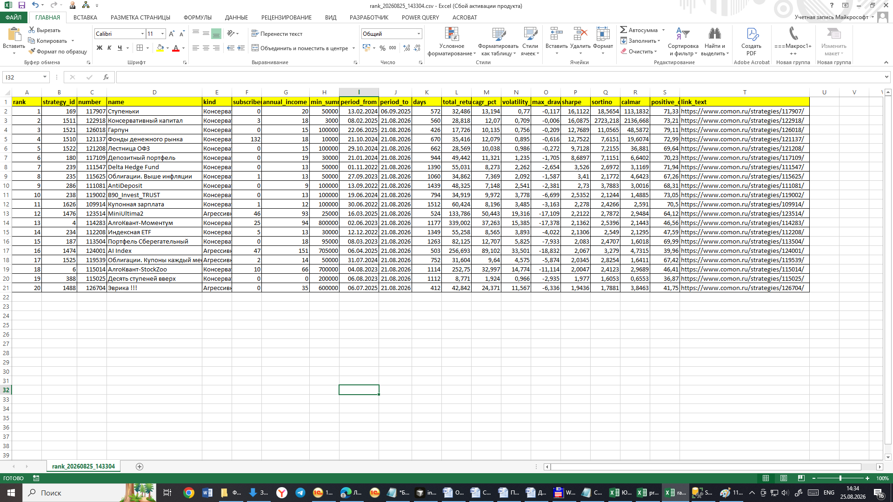
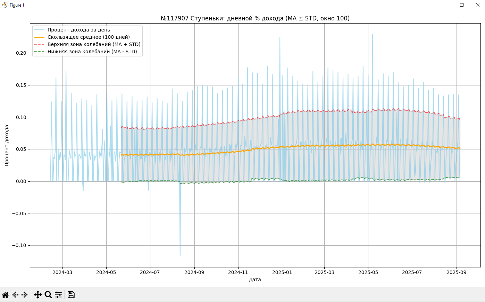
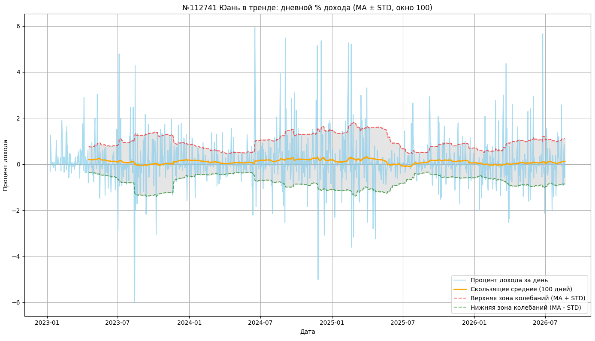
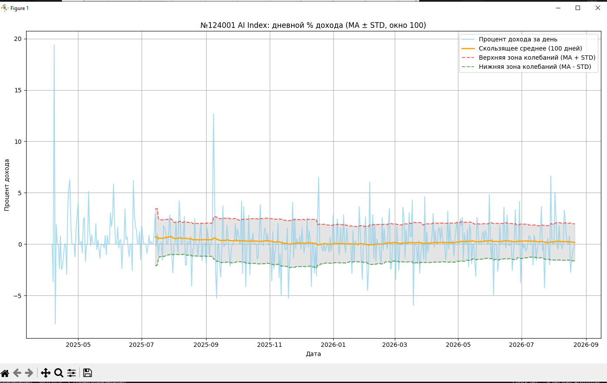

# FinamStrategiesAnaliz

Сбор и анализ **публичных** данных об инвестиционных стратегиях с [comon.ru](https://www.comon.ru/strategies/) (Finam): карточки стратегий и дневная история доходности → MSSQL → метрики риска и рейтинг. Личный / исследовательский data pipeline, не коммерческий сервис.

Проект использует Selenium (страницы сайта), неофициальный HTTP API доходности, SQLAlchemy и Alembic.

## Дисклеймер

**Это не инвестиционная рекомендация.** Рейтинг (`analiz/rank.py`), метрики Sharpe / CAGR / Calmar и графики — расчёты по историческим рядам из вашей БД. Они не являются советом покупать, продавать или подключать стратегию на comon.ru.

- данные с сайта и из API могут быть неполными, запаздывать или расходиться с калькулятором;
- прошлые результаты **не гарантируют** будущую доходность;
- решения об инвестициях вы принимаете самостоятельно и на свой риск.

Проект не связан с АО «ФИНАМ» и не является официальным продуктом comon.ru.

## Лицензия

Код распространяется по [MIT License](LICENSE) (в файле есть перевод на русский): можно использовать, копировать и изменять при сохранении уведомления об авторстве. Программа предоставляется «как есть», без гарантий.

Лицензия покрывает **исходный код репозитория**, а не данные comon.ru / Finam. Использование сайта и API — на ваш риск и в рамках их правил; см. дисклеймер и [COMON_SCRAPING_LEGAL.md](COMON_SCRAPING_LEGAL.md).

## Источники данных: Selenium и API

Два независимых способа получить историю (оба **не** Finam Trade API):

1. **Selenium** — как в браузере: страница стратегии, калькулятор доходности, даты по дням. Медленно, но совпадает с тем, что видит пользователь. Запасной путь, если API недоступен (`load_history.py --force-selenium`).
2. **Неофициальный (undocumented) HTTP API** — `GET https://www.comon.ru/api/v1/strategies/{number}/profit`. Публичный JSON без логина, **без документации, SLA и гарантий**. Finam может сменить URL, формат или закрыть доступ. Это **не** [Finam Trade API](https://api.finam.ru/).

`load_history.py` сначала проверяет API (`probe_profit_api`); если ответ корректный — грузит историю одним запросом, иначе — Selenium. После загрузки проверка идёт **по старому**: калькулятор на сайте (`lib/verify.py`), независимо от того, как писали в БД.

В открытых общих правилах comon.ru **явного запрета парсинга не найдено** (это не разрешение и не юрконсультация) — [COMON_SCRAPING_LEGAL.md](COMON_SCRAPING_LEGAL.md). Риски публикации: [PUBLISHING_RISKS.md](PUBLISHING_RISKS.md). План: [plan.md](plan.md).

**Вежливое использование:** не перегружайте серверы Finam/comon частыми и параллельными запросами. Делайте паузы между обращениями, не запускайте массовую выгрузку без необходимости, предпочитайте инкрементальное обновление вместо полной перезагрузки истории. Соблюдайте правила сайта; используйте проект разумно и на свой риск.

## Быстрый старт

```bash
python -m venv venv
venv\Scripts\activate.bat
pip install -r requirements.txt   # если есть; иначе — зависимости из окружения
alembic upgrade head
```

Скопируйте `.env.example` в `.env` и задайте `DATABASE_URL` (или `MSSQL_*`) для MSSQL, при необходимости настройте Chrome.

## Конвейер данных

| Скрипт | Назначение |
|--------|------------|
| `run.py` | Загрузка **карточек стратегий** с comon.ru → таблица `strategies` |
| `load_history.py` | Загрузка **дневной истории** доходности → таблица `history` |
| `test.py` | Массовая **проверка** накопленной доходности (БД vs сайт) |
| `test_intervals.py` | Проверка по **интервалам** для одной стратегии |
| `analiz/rank.py` | **Рейтинг** стратегий по метрикам доходности и риска |
| `lib/verify.py` | Общая логика верификации после загрузки истории |

### Загрузка списка стратегий

```bash
python run.py              # все страницы, обновление существующих
python run.py --only-new   # только новые стратегии
```

### Загрузка истории

```bash
python load_history.py                                    # API, при сбое — Selenium; все активные, до вчера
python load_history.py -n 112741                          # одна стратегия
python load_history.py --force-selenium -n 112741         # только Selenium
python load_history.py -n 109075 --end-date 2025-11-26
python load_history.py --reload -n 109075 --from-date 2025-11-14 --end-date 2025-11-26
python load_history.py --clear-and-load -n 109075 --from-date 2024-01-01 --end-date 2024-12-31
```

Архивные стратегии (`archived = 1`) пропускаются при массовой загрузке; для них нужен явный `-n`.

### Проверка данных

```bash
python test.py
python test_intervals.py -n 112741 -d 200 --from-date 2024-01-01 --to-date 2024-12-31
```

### Рейтинг стратегий

```bash
python analiz/rank.py
python analiz/rank.py --from-date 2024-01-01 --to-date 2024-12-31 --top 20
python analiz/rank.py --sort-by calmar --kind умеренный --output reports/rank_2024.csv
```

### Симулятор входов/выходов

```bash
python -m sim.backtest -n 112741
python -m sim.backtest -n 117907 -w 100 --ma-min 0.0 --ratio-min 0.05
```

Алгоритм `MaStdThresholdAlgorithm`: вход, если скользящее среднее дневного % и отношение MA/STD не ниже порогов; выход, если любой из показателей ниже порога. В конце — график equity против buy&hold.

### Примеры вывода

Рейтинг (`analiz/rank.py` → CSV в Excel):



Графики дневной доходности (`analiz/stathist.py -n …`):







## Формат CSV-отчётов

Все отчёты в `reports/` используют единый формат (модуль `lib/csv_export.py`):

- **разделитель полей** — точка с запятой (`;`);
- **десятичный разделитель** — запятая (`,`), например `21,102` вместо `21.102`;
- **кодировка** — UTF-8 с BOM (удобно открывать в Excel).

## Модель данных

### `strategies`

| Поле | Описание |
|------|----------|
| `number` | Номер стратегии на comon.ru |
| `name`, `link_text` | Название и URL |
| `kind_id` | Тип: консервативный / умеренный / агрессивный |
| `subscribers` | Число подписчиков (с сайта) |
| `annual_income` | Заявленная среднегодовая доходность, % (с сайта) |
| `min_summa` | Минимальная сумма входа |
| `archived` | Стратегия в архиве |

### `history`

| Поле | Описание |
|------|----------|
| `datetime` | Дата |
| `strategy_id` | Связь со стратегией |
| `perc_income_day` | Дневная доходность, % |
| `perc_text` | Текстовое представление с сайта |

## Справка по метрикам

Метрики считаются в `analiz/metrics.py` по ряду дневных доходностей `perc_income_day` за выбранный период. Базовая единица — **один торговый день**; для годовых показателей используется **252 торговых дня** в году.

### Доходность

| Метрика | Поле в CSV | Описание |
|---------|------------|----------|
| **Совокупная доходность** | `total_return_pct` | Рост портфеля за период, %. Начальная стоимость = 100%, итог = произведение `(1 + r_day/100)` по всем дням минус 100%. |
| **CAGR** | `cagr_pct` | Среднегодовая доходность (Compound Annual Growth Rate), %. Приводит совокупный результат к «годовой ставке» с учётом длины периода. |

### Риск

| Метрика | Поле в CSV | Описание |
|---------|------------|----------|
| **Волатильность** | `volatility_pct` | Годовая волатильность, %. Стандартное отклонение дневных доходностей × √252. Чем выше — тем сильнее колебания. |
| **Max drawdown** | `max_drawdown_pct` | Максимальная просадка от пика, %. Строится кривая стоимости портфеля (equity); просадка — падение от локального максимума до минимума внутри периода. Отрицательное число (например, −12,5%). |
| **Доля положительных дней** | `positive_days_pct` | Процент дней с доходностью > 0. Простой индикатор «стабильности» без учёта величины просадок. |

### Доходность с учётом риска

| Метрика | Поле в CSV | Описание |
|---------|------------|----------|
| **Sharpe** | `sharpe` | `(средняя дневная доходность − безрисковая/252) / std × √252`. Сколько единиц доходности на единицу общего риска. Выше — лучше. Безрисковая ставка задаётся `--risk-free-rate` (доля, напр. `0.16` = 16% годовых). |
| **Sortino** | `sortino` | Как Sharpe, но в знаменателе только **downside**-волатильность (дни с отрицательной доходностью). Штрафует просадки сильнее, чем «хорошую» волатильность вверх. |
| **Calmar** | `calmar` | `CAGR / |max drawdown|`. Доходность на единицу максимальной просадки. Удобен для сравнения агрессивных стратегий. |

### Как читать рейтинг

- **`analiz/rank.py`** по умолчанию сортирует по **Sharpe** (лучший баланс доходность/риск).
- **`--sort-by calmar`** — если важнее пережить просадки при высокой доходности.
- **`--sort-by cagr`** — чистая доходность без учёта риска (осторожно с агрессивными стратегиями).
- **`--min-days 252`** — в рейтинг попадают только стратегии с историей не короче года.
- Сравнивайте **`cagr_pct`** с **`annual_income`** с карточки comon.ru: большое расхождение — повод проверить период или данные.

### Пример интерпретации

Стратегия с CAGR 29%, max drawdown −12%, Sharpe 1,82: за период рост ~29% годовых в среднем, худшая просадка от пика около 12%, риск-adjusted результат выше среднего (Sharpe > 1 часто считают хорошим ориентиром).

## Структура проекта

```
lib/
  browser.py      — создание Chrome WebDriver
  csv_export.py   — единый формат CSV-отчётов
  env.py          — настройки окружения (.env)
  load.py           — парсинг истории и списка стратегий
  save.py           — операции с БД
  strategy.py       — разбор карточки стратегии
  urlutils.py       — URL, даты, пагинация
  verify.py         — проверка загруженной истории
models/
  strategies.py     — SQLAlchemy-модели
analiz/
  metrics.py      — расчёт метрик по истории
  rank.py           — CLI рейтинга → CSV
  stathist.py       — график дневной доходности (MA ± STD)
sim/                — симулятор long-only (вход/выход), бэктест MA/STD vs buy&hold
docs/               — скриншоты рейтинга и графиков для README
```

## Что есть для анализа

| Компонент | Назначение |
|-----------|------------|
| `analiz/metrics.py` + `analiz/rank.py` | Метрики и рейтинг по истории из БД (~1–2 с на 100+ стратегий) |
| `test.py`, `test_intervals.py`, `lib/verify.py` | Верификация данных (БД vs сайт) |
| `analiz/stathist.py` | График дневной доходности, MA, полосы ± std |
| `sim/` | Симулятор long-only: `MaStdThresholdAlgorithm`, CLI `python -m sim.backtest -n …` |
| `query.sql` | SQL: avg/stdev дневной доходности по стратегиям |

### Пока не реализовано

- взвешенный **score** (комбинация метрик);
- визуализация equity / drawdown для нескольких стратегий;
- комиссии / мультистратегийный портфель в `sim/`;
- прогноз (`lib/nnlib.py` — заготовка LSTM).

## Дальнейшее развитие

1. **Симулятор** — комиссии, несколько стратегий с весами, другие алгоритмы.
2. **Визуализация** — equity curve, drawdown, сравнение стратегий (`stathist.py`).
3. **Скоринг** — настраиваемая формула по Sharpe, Calmar, drawdown, subscribers.

## Автор

**Имя** · Шуравин Александр  
**Роль** · Python developer  
**О проекте** · личный data pipeline по публичным стратегиям comon.ru (Finam): Selenium / API → MSSQL → метрики риска и рейтинг

### Контакты

| | |
|---|---|
| Telegram | [@ShuravinAlex](https://t.me/ShuravinAlex) |
| GitHub | [github.com/megabax](https://github.com/megabax) |
| TenChat | [tenchat.ru/5244130](https://tenchat.ru/5244130) |
| Habr | [habr.com/ru/users/megabax](https://habr.com/ru/users/megabax/) |

### Для работодателя / рекрутера

Кратко о стеке **этого** репозитория: Python, Selenium, requests (неофициальный profit API), SQLAlchemy + Alembic, MS SQL (pyodbc), pandas, matplotlib, pytest; CLI-конвейер (`run.py`, `load_history.py`, `analiz/rank.py`); слои `lib/` (загрузка / БД / verify) · `models/` · `analiz/` · `tests/`.

| | |
|---|---|
| Резюме (PDF) | [Google Drive](https://drive.google.com/file/d/1DLPi60uDSgN74iixhaLfZdzF9_WFVpF5/view?usp=drive_link) |
| Резюме (HH) | [hh.ru](https://izhevsk.hh.ru/resume/8ad4938fff10ad778c0039ed1f446b617a7149) |
| Готовность к работе | удалённо (предпочтительно); гибрид / офис — Ижевск |
| Целевая роль | ML / AI Engineer (LLM, CV, R&D); дата-сайентист / разработчик |

**Стек (из опыта, кратко):**

| Область | Технологии |
|---------|------------|
| LLM / AI | OpenAI-compatible API, DeepSeek, LangChain, RAG, embeddings (sentence-transformers, BGE), Ollama (Llama/Mistral), промпт-инжиниринг, privacy / 152-ФЗ (Natasha NER) |
| Computer Vision | PyTorch, OpenCV, YOLO, ONNX, OCR (Tesseract), Librosa |
| Backend / API | Python, FastAPI, asyncio, C#, REST, RabbitMQ |
| Данные | PostgreSQL, MS SQL, SQLite, Qdrant, MinIO / S3, pandas, NumPy |
| ETL / MLOps | Airflow, Docker, Linux, Prometheus, Grafana, n8n |
| Качество кода | Git, Pytest, UML / ООП |

Одной строкой: `Python · PyTorch · YOLO · OpenCV · FastAPI · Docker · PostgreSQL · Qdrant · LangChain / RAG · Airflow · C# · MS SQL · Linux`

> Вопросы по коду и резюме — удобнее в Telegram / Max.
